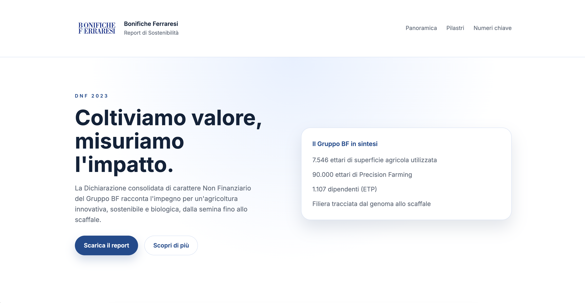
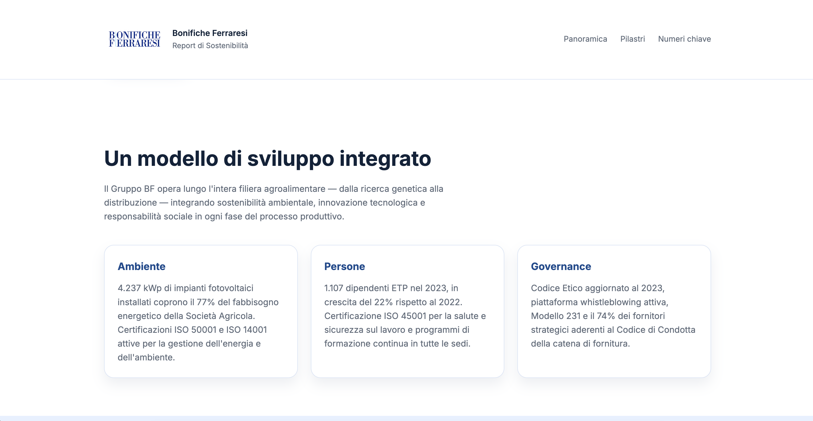
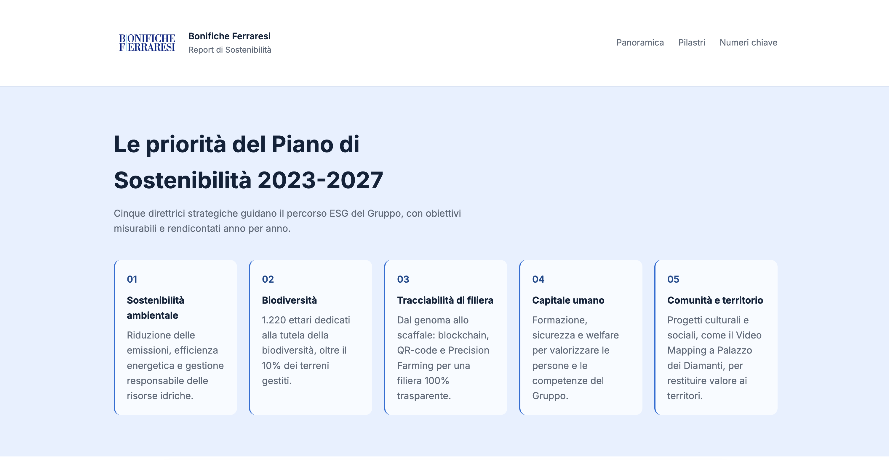
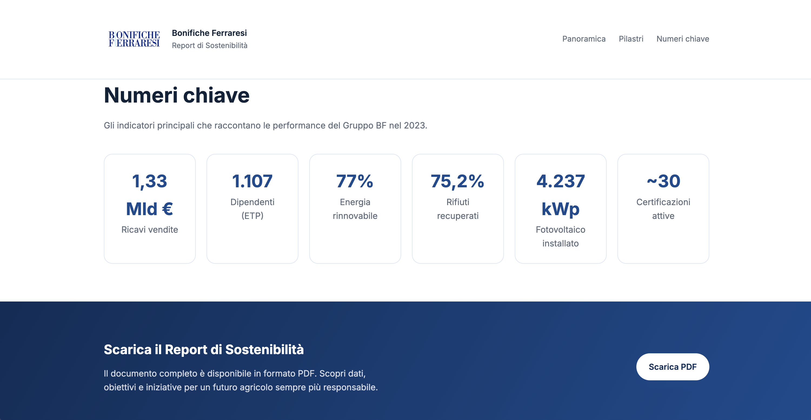

# Bonifiche Ferraresi - Report di Sostenibilità

## 📚 Project Work Unipegaso
**Università:** Unipegaso  
**Corso:** Informatica per le Aziende Digitali (L-31)  
**Argomento:** Report di Sostenibilità Bonifiche Ferraresi

---

## 📸 Anteprima delle Pagine

### Homepage


### Sezione Principale


### Pilastri di Sostenibilità


### Numeri Chiave


---

## 🚀 Come Scaricare e Visualizzare il Sito

1. **Clona o scarica i file**
   ```bash
   git clone <repository-url>
   # oppure scarica i file ZIP dalla repository
   ```

2. **Estrai i file** (se hai scaricato il ZIP)
   - Estrai la cartella in una posizione a tua scelta

3. **Apri il file HTML**
   - Naviga nella cartella del progetto
   - Fai doppio clic su `index.html`
   - Il sito si aprirà automaticamente nel tuo browser predefinito

4. **Esplora il sito**
   - Utilizza il menu di navigazione per muoverti tra le sezioni
   - Clicca sui link "Scarica il report" per accedere al report di sostenibilità

---

## 📁 Struttura dei File

```
Tesi/
├── index.html          # File principale del sito
├── style.css           # Foglio di stile
├── images/             # Cartella con le immagini
│   ├── logo.png
│   ├── page1.png
│   ├── page2.png
│   ├── page3.png
│   └── page4.png
└── README.md           # Questo file
```

---

## 🎨 Tecnologie Utilizzate

- **HTML5** - Struttura semantica della pagina
- **CSS3** - Styling e layout responsive

---

## 

Questo progetto è stato sviluppato come Project Work per l'università Unipegaso, Corso di Informatica per le Aziende Digitali L-31.

© 2026 Bonifiche Ferraresi. Pagina web a scopo didattico.
